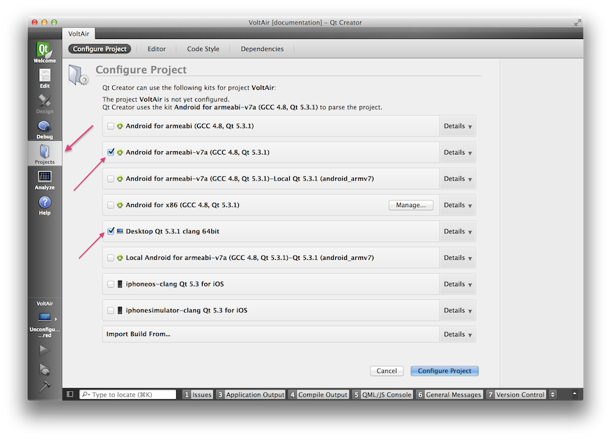
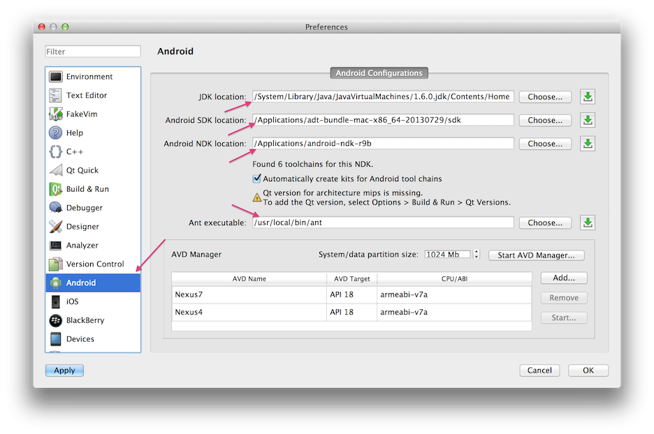
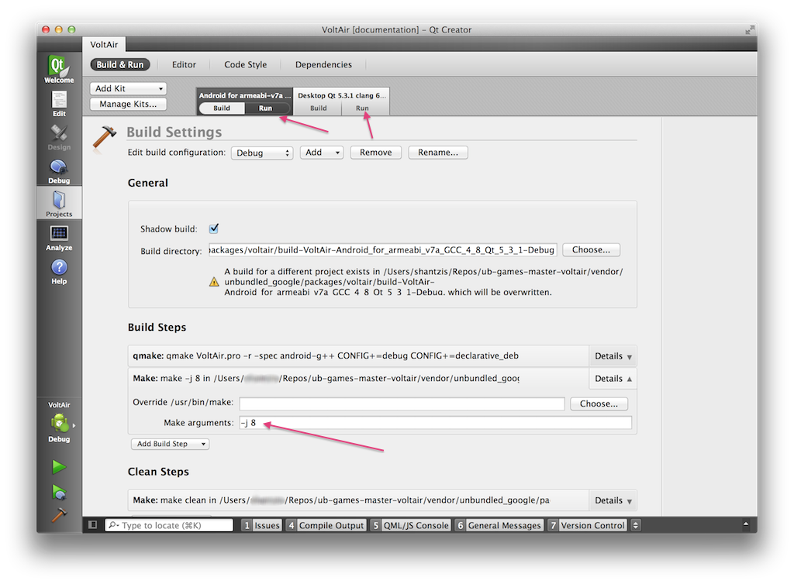
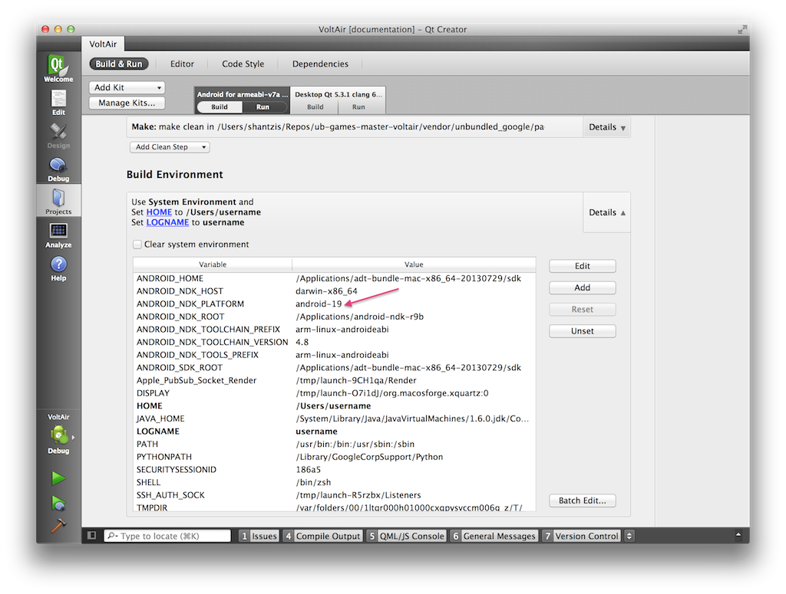
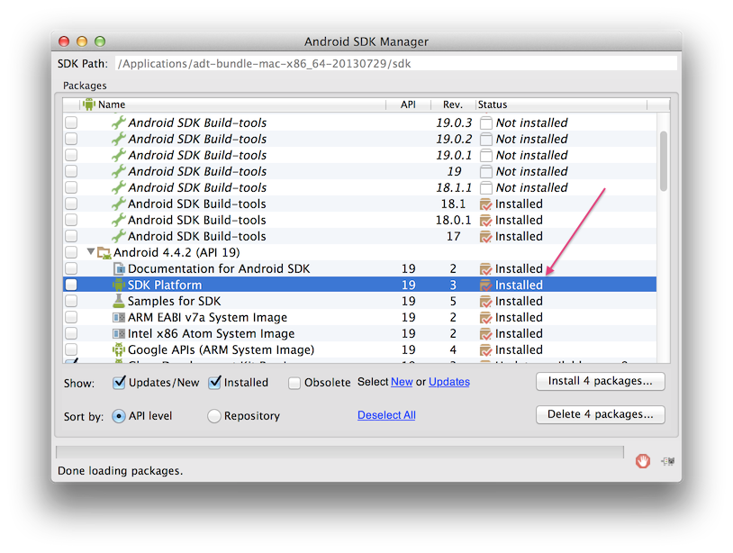

# Configuring Qt Creator

# Opening up the VoltAir Project

Start up *Qt Creator*.  It will look like this (on the Mac). Please Press the *Open Project* button,
found here:

Navigate to the `voltair` tree, and then one more level down into `VoltAir`, in which you will find
a file called `VoltAir.pro`, as seen here:

Upon opening, you will be presented with the following dialog box about *kits* (if this dialog does
not show up, hit the *Projects* button on the left). Kits are the way *Qt Creator* provides for
building to multiple platforms. Please select the following two kits:
* Android for armeabi-v7a (GCC 4.8, Qt 5.3.1)
* Desktop Qt 5.3.1 clang 64bit

The name of the latter may be slightly different under Linux.

When you are done, hit the *Configure Project* button.

# Setting Android Preferences

Next we must make certain that *Qt Creator* is properly configured to build for Android.  To do
this, first bring up the *Preference* dialog box (found in the *Qt Creator* menu on the mac). Then
on the left, click on the *Android* section. There are four software subsystems you will have to
populate:
* **JDK Location**: The location of the *java* *bin/* and *lib/* directories on your machine.
  Typically found in <i>/System/Library/Java/JavaVirtualMachines/1.6.0.jdk/Contents/Home</i> on a
  mac.
* **Android SDK Location**: This is the *sdk* directory of the download found on the
  [Android SDK Download][] page, as seen in the example below.
* **Android NDK Location**: This is the root directory of the download found on the
  [Android NDK Download][] page, as seen in the example below.  **NOTE: Please use android-ndk-r9b
  or later.**
* **Ant executable**: This is the path to the Apache *ant* executable. It can be obtained via
  [Macports][] or [Homebrew][] on the Mac or [Apt-get][] under linux.  **NOTE: Please use ant
  version 1.9 or later.**

# Setting Up Parallel Build

*VoltAir* has scores of C++ files that need to get built. Given this, it makes sense to run its
*make* in parallel. We take the following steps to set this up:
* In *Qt Creator*, bring up the *Projects* section.
* For each of the kits (there are two, remember), select the *Build* section, as seen below.
* Under the *Build Steps*, open up the *Details* on the *Make* step.
* In the *Make Arguments* line entry, type `-j 8`.
* Again, remember this needs to be done twice, once for each kit.

# Referencing an External [LiquidFun][]

If you are building [LiquidFun][] strictly for *VoltAir*, simply make sure it is cloned as specified
in [Downloading VoltAir][] and built as stated in the [LiquidFun Build Instructions][].

As mentioned earlier, the *VoltAir* git repository is set up to include a [LiquidFun][] submodule
(see [Downloading VoltAir][] for more information). However, if you have a pre-existing version of
[LiquidFun][] that you wish to use instead, you can do so by appropriately setting a **LIQUIDFUN**
variable in your build environment. Take the following steps:
* In *Qt Creator*, bring up the *Projects* section.
* For each of the kits (there are two, remember), select the *Build* section, as seen below.
* Under *Build Environment*, press the *Details* button, which brings down a list of environment
  variables.
* Press the *Add* button to add another one, name the variable *LIQUIDFUN* and set its value to the
  root of your [LiquidFun][] directory.
* Again, remember this needs to be done twice, once for each kit.

# Setting Android Environment to use the android-19 API

This ONLY applies to the *Android for armeabi-v7a (GCC 4.8, Qt 5.3.1)*.
In the same *Build Environment* location, make certain that the **ANDROID_NDK_PLATFORM** is set to
**android-19**.

You also need to make certain that your Android SDK has API 19 installed. This is done from within
the [Android SDK Manager][]. The image below shows what you should expect to see:

For more information on configuring *Qt Creator*, please see the [Configuring Projects][]
of the official Qt documentation.

You are now ready to proceed to
[Building and Running VoltAir](md__building_and_running_volt_air.html).

[Android SDK Download]: http://developer.android.com/sdk/index.html
[Android NDK Download]: https://developer.android.com/tools/sdk/ndk/index.html
[Macports]: https://www.macports.org/install.php
[Homebrew]: http://brew.sh/
[Apt-get]: https://help.ubuntu.com/12.04/serverguide/apt-get.html
[LiquidFun]: http://google.github.io/liquidfun
[Configuring Projects]: http://qt-project.org/doc/qtcreator-3.0/creator-configuring-projects.html
[Download VoltAir]: md__downloading_volt_air.html
[LiquidFun Build Instructions]:http://google.github.io/liquidfun/Building/html/index.html
[Android SDK Manager]: http://developer.android.com/tools/help/sdk-manager.html
