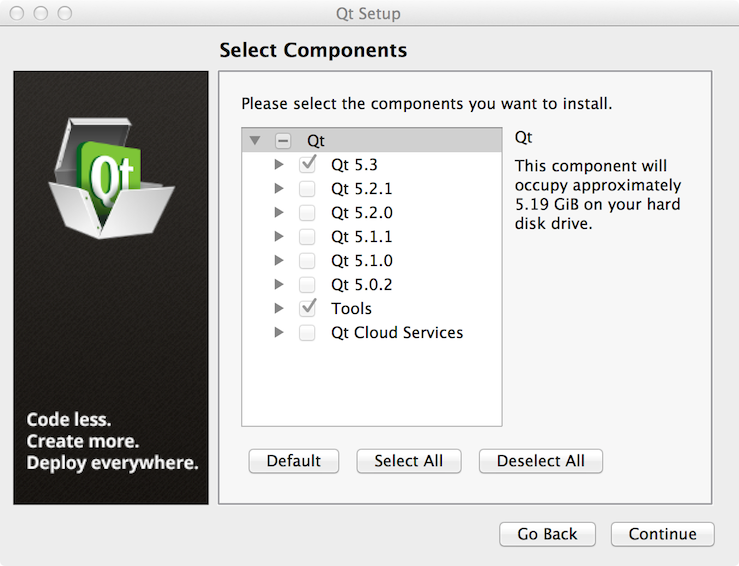

# Installing Qt

The first step in getting VoltAir running is to download and install [Qt][]. Please visit the
[Qt Download Page][] and follow the steps to installation.

IMPORTANT: VoltAir will only build and run with Qt 5.3.1 or later.

When in the "Select Components" section, select only the Qt 5.3 version, as seen below:

Once [Qt][] has been installed, you can proceed to the
[Configuring Qt Creator](md__configuring_qt_creator.html) page.

[Qt]: http://qt-project.org/
[Qt Download Page]: http://qt-project.org/downloads
