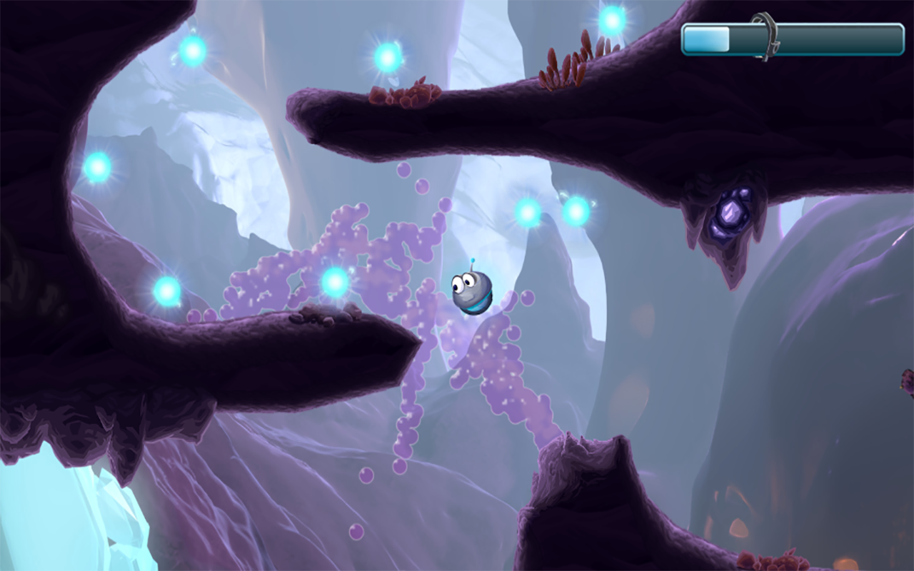
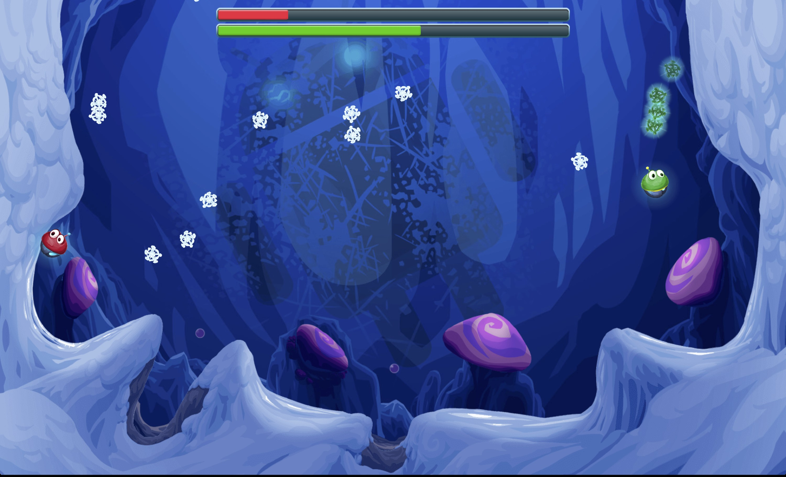
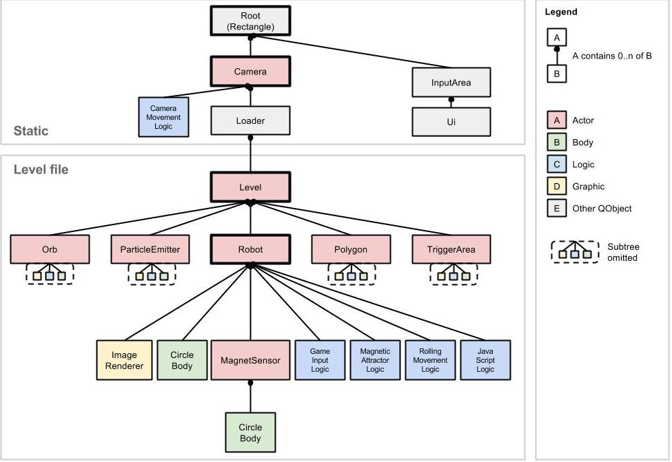
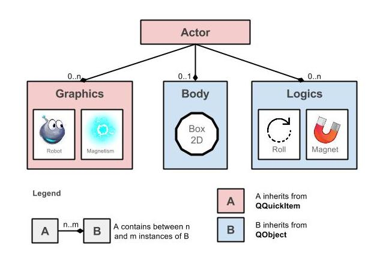
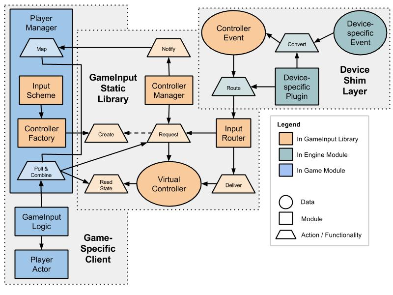
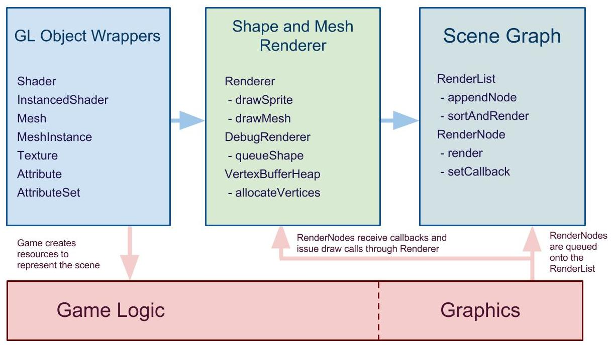

The VoltAir Project {#mainpage}
===============================

## Overview

For questions, comments, or concerns not addressed below, feel free to join and email the [VoltAir
discussion group][VoltAirDiscuss], or dicuss online using `#VoltAir` (e.g. on StackOverflow or
Twitter).

  <ul>
    <li>[Overview](#1)</li>
    <li>[Getting Started][GettingStarted]</li>
    <li>[Contributing][]</li>
    <li>[API Reference][APIReference]</li>
  </ul>

1. [What is VoltAir?](#1)
2. [How do I get started using VoltAir?](#2)
3. [Where can I find documentation on the VoltAir source code?](#3)
4. [How do I contribute to the VoltAir project?](#4)
5. [Why was VoltAir developed?](#5)
6. [Is VoltAir still being developed?](#6)
7. [What platforms can I build and run VoltAir on?](#7)
8. [What versions of Android is VoltAir compatible with?](#8)
9. [What devices is VoltAir known to run on and why aren't more devices supported?](#9)
10. [Why did we choose to use C++?](#10)
11. [Why did we choose to use Qt and what is QtQuick?](#11)
12. [What is the high-level design of VoltAir?](#12)
13. [What is GameInput, why did you build it, and how do you use it?](#13)
14. [What is the VoltAir Renderer and what are some tricks behind the visuals?](#14)
15. [What is the VoltAir Engine, and is it really a game engine?](#15)
16. [Why is there all this JavaScript?](#16)
17. [How did you design the UI?](#17)
18. [If I want to develop my own new application based on the VoltAir source code, where do I
    start?](#18)
19. [How did you integrate Box2D / LiquidFun?](#19)
20. [How could I use the different particle types in LiquidFun and what other additional features
    could I add to VoltAir?](#20)
21. [Where is the level editor?](#21)
22. [Why aren't you using the Play Games Services C++ SDK?](#22)
23. [What's the deal with the sound files in the open source code?](#23)
24. [What workarounds did you need to implement?](#24)

**************************************************

##  What is VoltAir?

The Fun Propulsion Labs at Google are quite proud to announce that VoltAir, a casual single and
local multiplayer game, is now available on the [Google Play Store][VoltAir] and as [open source
software][GettingStarted].

The game features a spunky, speedy robot stranded on an alien planet. Going as fast as his single
wheel will carry him, he flies over ramps, zips around meteors, and rides geysers in his search for
the portal that will take him home.

VoltAir shows how versatile our LiquidFun tech can be when applied to a consumer application.
LiquidFun is a C++ 2D physics library based on Box2D that includes high-performance particle
simulation. It's used a few different ways in the game, as an obstacle for our little robot hero to
work around, as a platform that lifts our hero to new heights, and simply as a way to add moving,
splashing, graphic touches to levels.

We built the game on top of [QtQuick][], which you can read more about [below](#11).

**************************************************

##  How do I get started using VoltAir?

You can download and play a [working copy of VoltAir][VoltAir] off of the Google Play Store or take
a look at [the introduction to our open source project][GettingStarted] to get started downloading,
building, and running the project.

**************************************************

##  Where can I find documentation on the VoltAir source code?

To see our source code documentation, take a look at our [API Reference][APIReference].

**************************************************

##  How do I contribute to the VoltAir project?

For information on working on the VoltAir project, please see our [Contributing page][Contributing].

**************************************************

##  Why was VoltAir developed?

VoltAir was developed to provide an example of a C++ game designed for both Android and Android TV.
For example, it shows on-screen controls when run on a mobile device, but does not show controls
when on a TV. Additionally, VoltAir demonstrates controllers, local multiplayer in Android, and how
to closely integrate [LiquidFun][].

VoltAir was not developed to compete with existing platform games, to make money, to provide a
full-length game, or to actively promote the use of Qt in making games.

**************************************************

##  Is VoltAir still being developed?

Not at this time, but have a look at our [Contributing page][Contributing] for submitting back to
the project.

**************************************************

##  What platforms can I build and run VoltAir on?

We've tested building VoltAir on Mac OS X and Ubuntu, targeted for running on Mac OS X, Ubuntu, and
Android devices.

Theoretically, with a bit of work, other platforms could be supported through the cross-platform
nature of Qt and Qt Creator.

**************************************************

## What versions of Android is VoltAir compatible with?

VoltAir is known to run on Android 18+ and Android TV.

**************************************************

##  What devices is VoltAir known to run on and why aren't more devices supported?

VoltAir has been tested on Nexus 5, Nexus 7, Moto X by Motorola, Android TV, and some Samsung
devices. Some devices are not supported because we did not optimize for all phones, and, as a
result, the game would not perform well enough on them.

**************************************************

##  Why did we choose to use C++?

We chose to develop in C++ because it has better performance than Java, more directly integrates
with LiquidFun, and is more familiar to the game developer community.

**************************************************

##  Why did we choose to use Qt and what is QtQuick?

[QtQuick][] is one of the many frameworks provided by the [Qt Project][Qt]. It is best described as
a 2D scene graph with an accompanying renderer. You can build up a tree of items, each of which
represents some aspect of the scene: graphics, physics, input, audio, data storage, etc. You can
also define your own items by either subclassing `QQuickItem` (for items that have some graphical
significance) or `QObject` (for items that are important for other uses). NOTE: `QQuickItem` is
actually a subclass of `QObject`.

The QtQuick framework provides only a very shallow hierarchy of `QQuickItem` subclasses. Instead,
the prescribed way to instantiate the objects is to write the graph in *QML*, a markup language in
which you can describe hierarchies of `QQuickItem`s. Instead of providing a class hierarchy of
`QQuickItem`s, Qt provides a hierarchy of QML `Item`s, of which there are hundreds. When you
subclass from `QQuickItem`, you can register your class to become available in QML as well. You can
also write a QML file that can then be instantiated as you would a single `Item`.

Due to time constraints, writing our own engine from the ground up wasn't really an option. We
looked at various UI frameworks and game engines and decided Qt was not only the more daring choice
due to the lack of games developed in it, but also a very interesting one due to the future ability
to extend it into a rich editor, support from Digia, and many technical development advantages such
as:
  * Provided a platform abstraction that allowed us to also develop and test on desktop, reducing
    iteration time
  * Included a scene graph and out of the box "serialization" mechanism
  * Allowed for easily building a fluid UI system that was good for games
  * Provided an object model with dynamic JavaScript bindings, properties, as well as callback
    mechanisms for easy scripting and prototyping
  * Contained a well integrated IDE ([QtCreator][])
  * Included a flexible [LGPL License][QtLicense]

**************************************************

##  What is the high-level design of VoltAir?

### Game Design

VoltAir is a fun, physics-based 2D adventure inspired by the mobile era zeitgeist, featuring a
single-player campaign and a local multiplayer arena for up to 4 players, that works well on both
mobile and Android TV devices. Below is a description of some of the aspects of the two modes of
gameplay:
  * **Single Player Campaign**:

    In the single player campaign, players navigate a "robot" through multiple levels using rolling
    on a surface  and "magnetizing" towards "meteors" to collect energy balls in their path. There
    are liquids flowing throughout the levels that create obstacles and puzzles.

    For a gamepad, rolling is controlled via a left or right action on the joystick, dpad, or
    `L2/R2` triggers. Magnetism is controlled via the `A` button or `L1/R1` triggers. On other
    devices, such as keyboards or touch screens, these actions map to other logical inputs.

    Once a player has collected enough energy, a portal at the end of the level will open allowing
    them to advance to the next level. Google Play Games Services achievements are awarded during
    gameplay based on energy collection, speed, and other creative conditions.

    

  * **Multi Player Arena**:

    In the multiplayer arena, up to 4 players compete on a single device, possibly using different
    controllers or splitting a single keyboard. A player simply joins the game by sending any event
    from a previously paired input device. Gameplay is very similar to single player, however the
    multiplayer arena differs by being a fixed space in which the characters move with no explicit
    puzzles to solve, but rather a goal of collecting as many energy snowflakes as possible. These
    snowflakes, while having similar energy properties to the orbs in single player, differ in that
    they can be magnetically attracted to robots that are magnetized, making them a dynamic element
    in the game.

    In addition to the snowflakes being magnetic, players discover that robots, when magnetzied,
    also attract one another, and they can use this ability as a spoiler mechanic. The arena also
    features several bumpers and liquids that players can use to accelerate towards the snowflakes,
    which are constantly flowing from the top of the screen.

    The player who collects a set number of snowflakes first is the winner.

    

### Software Design

All aspects of VoltAir are defined by a hierarchy of QML `Item`s. There is both a static section of
the scene graph hierarchy that always remains loaded and a dynamic section, which is loaded and
unloaded during the course of the game, as seen below:

What follows are the details about these various node types:

  * **Root**:

    The Root node is itself very lightweight and serves as the starting point for scene traversal.
    It has input and UI managers as well as the Camera as children.

  * **Camera**:

    The [Camera][] controls how everything below it is rendered. Its `lookAt` property determines
    where the camera points, and its `fov` property controls the zoom level. The [Camera][] is able
    to deal with different aspect ratios as well as manage the parallax system which causes objects
    in different depth layers to move at different speeds, thereby creating the illusion of depth.
    The [Camera][] also contains a logic for following one or more player characters in the level

  * **Level**:

    The [Level][] is the representation of a single level during gameplay. It is the part that is
    dynamically loaded and unloaded as the player advances from one level to the next.

  * **Loader**:

    The `Loader` is used to asynchronously load levels into the scene graph since calls to
    `QQmlComponent::create()` blocked the UI and rendering thread, making the game become
    unresponsive during loads. For more information, see our [workarounds section below](#24).

  * **Actor**:

    Perhaps the most important item class we defined for VoltAir is the [Actor][]. It is the basic
    character unit for our game. The [Actor][] is a `QQuickItem` that holds onto the smaller
    building blocks of the game scene. Each [Actor][] has at least three classes of children:
      * [Graphic][]s, which are responsible for drawing
      * [Body][], which is the physical representation of the actor
      * [Logic][]s, which are responsible for computation that is not performed by the physics

  * **InputArea**:

    The [InputArea][] is a module for gaining basic input event (i.e. keyboard) support on
    non-Android devices. See the details of [GameInput](#13) below for more information.

  * **Ui**:

    The [Ui][] serves as a manager for all possible viewing states of the games overlay UI,
    including menus, splash or loading screens, and heads-up display (hud) information.

The following diagram shows the layout of the main character in VoltAir, the [Robot][]. We see its
graphics have many states that can be animated (e.g. its magnetism's visibility can change,
its eyes can move, etc.). The [Body][] is a circle so it can roll. Its logics handle behavioral
aspects such as its rolling, player-input directed forces, etc.

As we see, an [Actor][]'s subobjects are both `QQuickItem`s and `QObject`s. This table shows more
explicitly which are of which subclass (note how only objects involved in graphics traversal are
`QQuickItem`s) and specific examples of their use in the game:

| Class       | Inherits from | Description                                                                                                                                                | Examples                                            |
|-------------|---------------|------------------------------------------------------------------------------------------------------------------------------------------------------------|-----------------------------------------------------|
| [Actor][]   | `QQuickItem`  | Top-level element in the game. May contain visuals, a physics body, and behavioral logics, defining the **composition** and configuration of its elements. | [Robot][], [Portal][], [Orb][], [ParticleEmitter][] |
| [Graphic][] | `QQuickItem`  | `Image`s or [Renderer][]s defining the **look** of the [Actor][].                                                                                          | [ImageRenderer][], [TerrainMeshRenderer][]          |
| [Body][]    | `QObject`     | Defines the **physical body** of an [Actor][], wraps Box2D body.                                                                                           | [CircleBody][], [PolygonBody][]                     |
| [Logic][]   | `QObject`     | Logical **behavior** of the [Actor][], evaluated every frame.                                                                                              | [RollingMovementLogic][], [ParticleEmitterLogic][]  |

**************************************************

##  What is GameInput, why did you build it, and how do you use it?

### Motivation

To achieve support for different "controller" types (i.e. input devices which could logically be
used to control the robot character) and multiple input sources, we implemented a separate input
layer abstraction, [GameInput][], that could be re-used for handling controller input in a variety
of controller-based applications.

The need for such a system arose with the realization that Qt's event system based around `QEvent`
did not support all desired controller types, nor did it support differentiation of input sources.
Specifically, there does not currently exist a subclass of `QEvent` capable of representing
real-valued axis events, and, instead, Qt's platform-dependent input handling delegates convert such
input into `QKeyEvent`s (e.g. on Android, holding right on a thumbstick would generate a "right" key
event). Furthermore, `QEvent` lacks the fundamental concept of device ID, meaning all identical
input events on different controllers are indistinguishable from one another, which would prevent
local multiplayer support.

### Goals

  * Support keyboard, gamepad, and touch navigation input devices as controllers on Android
  * Minimally support keyboard for input on all non-Android platforms
  * Support mapping unique input devices to unique players
  * Support non-1:1 mappings (i.e. splitting) of input devices to players (e.g. left-half of
    keyboard vs. right-half of keyboard as different players)
  * Re-usable module for use in other controller-based applications with no VoltAir-specific logic
    tied into it
  * Easily extensible to other controller "types"

### Non-goals

  * Have parity on all platforms for input support
  * Extension of Qt's pre-existing `QEvent` system
  * Support asynchronous input event game models (i.e. responding to input events immediately at
    their time of occurrence)

### Overview

To that end, the GameInput library contains three major components:
  * **GameInput Static Library**:

    Main, platform-independent module that defines logic for handling of input events, storing
    controller state, and defining controller input schemes.

  * **Device Shim Layer**

    Intermediate, platform-dependent module for converting device-specific events into general
    platform-independent [ControllerEvent][]s and routing them to the appropriate [InputRouter][].

  * **Game-Specific Client**

    Application-dependent code that establishes how [VirtualController][]s are mapped to players,
    defines the canonical set of schemes mapping inputs to actions, and provides mechanisms for
    querying of the state of particular player actions.

### Module Classes

| GameInput Library Class | Description                                                                                                                                                                                                                                                                                                                                                                                                                                                                                                             |
|-------------------------|-------------------------------------------------------------------------------------------------------------------------------------------------------------------------------------------------------------------------------------------------------------------------------------------------------------------------------------------------------------------------------------------------------------------------------------------------------------------------------------------------------------------------|
| [ControllerEvent][]     | A platform-independent event capable of representing input generated by any type of controller.                                                                                                                                                                                                                                                                                                                                                                                                                         |
| [VirtualController][]   | A representation of a physically-based controller (or part of one) with a unique device ID, 0 or 1 of each type of [InputScheme][], input capabilities that can be described by a [ControllerEvent][], support for handling events marked with the same device ID, storage of current state, and an ability to be queried current action value depending upon support (binary, unit value, symmetric unit value) for those actions.                                                                                     |
| [InputScheme][]         | A mapping from generic input "events" (e.g. key codes or trigger axes) to output "actions".                                                                                                                                                                                                                                                                                                                                                                                                                             |
| [ControllerFactory][]   | Interface for constructing [VirtualController][]s from a device ID. Factories encapsulate component [InputScheme][]s that comprise a [VirtualController][] and implicitly define controller "types" in the process. For example, the [GamepadControllerFactory][] creates gamepad-related [VirtualController][]s with a specified [KeyScheme][], [JoystickAxisScheme][], and [TriggerAxisScheme][].                                                                                                                     |
| [InputRouter][]         | Routes [ControllerEvent][]s according to inherent ControllerFactory specifications. Specifically, the router creates an additional abstraction layer onto physical device IDs, allowing one physical device to be split into multiple [VirtualController][]s via different [ControllerFactory][]s that contain non-intersecting input schemes. As a result, the "type" of InputRouter is defined implicitly by the [ControllerFactory][]s that comprise it (e.g. [GamepadRouter][] uses [GamepadControllerFactory][]s). |
| [ControllerManager][]   | Manager to maintain a global list of connected controllers and notify registered listeners of changes in these connection statuses.                                                                                                                                                                                                                                                                                                                                                                                     |

 

| Device Shim Layer Class                   | Description                                                                                                                                                                                                                                                                     |
|-------------------------------------------|---------------------------------------------------------------------------------------------------------------------------------------------------------------------------------------------------------------------------------------------------------------------------------|
| [VoltAirActivity][] / [AndroidActivity][] | Intercepts Android-specific input events (`KeyEvent`s and `MotionEvent`s) and converts them (via JNI) into [ControllerEvent][]s that are routed to the appropriate [InputRouter][] according to Android-defined input sources (e.g. keyboard vs. gamepad vs. touch navigation). |
| [InputArea][]                             | Intercepts Qt key input events (`QKeyEvent`s) on non-Android platforms and converts them into [ControllerEvent][]s that are routed to the [KeyboardRouter][].                                                                                                                  |

 

| Game-specific Class | Description                                                                                                                                                                                                                                                                                                                                                                                                                        |
|---------------------|------------------------------------------------------------------------------------------------------------------------------------------------------------------------------------------------------------------------------------------------------------------------------------------------------------------------------------------------------------------------------------------------------------------------------------|
| [PlayerManager][]   | Manager that establishes a mapping from unique player identifiers to different [VirtualController][]s that connect and disconnect throughout the game. Additionally, the manager abstracts away the different controller capabilities (i.e. different combinations of action support), instead defining and allowing the simple querying of relevant player values (e.g. horizontal motion or magnetized) through special methods. |
| [GameInputLogic][]  | Behavior that synchronously updates its parent [Actor][]'s player-related properties (e.g. horizontal input force and magnetized) each frame by polling the [PlayerManager][]'s reported state for the actor's player ID.                                                                                                                                                                                                          |

### Example Input Event Data Flow

To better elucidate the operation and usage of the GameInput library, consider the following
sequence of events which occur in the first time the VoltAir application receives a `KeyEvent` on
Android for the left arrow key:
  1. [VoltAirActivity][] intercepts the `KeyEvent` in `dispatchKeyEvent()`.
  2. [AndroidActivity][] receives the `KeyEvent` via a native callback.
  3. [AndroidActivity][] converts the `KeyEvent` into an associated [ControllerEvent][], maintaining
     the original device ID, and passes it off to the [KeyboardRouter][] for handling.
  4. [KeyboardRouter][], having been initialized with a [KeyboardControllerFactory][] whose
     [KeyScheme][] mapped a left arrow key code to the "left" action, accepts the event for routing.
  5. [KeyboardRouter][] then rewrites the [ControllerEvent][]'s device ID with a unique, fake device
     ID, and remembers the fake device ID used for the real deviceID and the matching
     [KeyboardControllerFactory][]. Thus, in the future, `UP-DOWN-RIGHT` events from this keyboard
     can be mapped to the same [VirtualController][], but `UP-DOWN-RIGHT` events from another
     keyboard ord `A-S-D` events from the same keyboard can both be mapped to different
     [VirtualController][]s.
  6. [KeyboardRouter][] then requests a [VirtualController][] with the relevant fake device ID from
     the [ControllerManager][], providing the manager with a reference to the matching
     [KeyboardControllerFactory][].
  7. Having never seen the provided device ID before, the [ControllerManager][] uses the provided
     factory to construct a new keyboard-related [VirtualController][] and return a reference to it,
     but not before notifying all listeners that a controller with the fake device ID has connected.
  8. [PlayerManager][] receives the connection notification and maps this fake device ID to the
     first available player ID.
  9. [KeyboardRouter][], now having a reference to a [VirtualController][], simply routes the
     [ControllerEvent][] to it, causing it to update its internal state appropriate according to the
     [KeyScheme][] from which it was constructed. This state can then be queried through methods
     defined in [PlayerManager][] for the appropriate player ID.

**************************************************

##  What is the VoltAir Renderer and what are some tricks behind the visuals?

### Motivation

To achieve high enough performance in rendering of our game's scene (i.e. [Actor][]s such as terrain
pieces, characters, and collectables), we implemented VoltAir's [game-specific
renderer][GameRenderer], a simple 2D scene, OpenGL renderer, and use QtQuick's renderer exclusively
for the UI.

The main objective for this renderer is simplicity, as our initial investigations indicated our
target devices can achieve sufficient fill rate to render scenes of our game's complexity, even with
naive draw calls and structure. Much of QtQuick's slowness appears to instead be caused by
significant CPU overhead processing geometry (e.g. to merge vertex batches) and the use of
synchronous GL driver calls. The performance hit from this overhead is compounded by the fact that
we use fluid simulations, which are also CPU heavy.

### Goals
  * Support rendering 2D scenes of simple to medium complexity
  * Provide a low CPU overhead renderer implementation which is malleable and reusable
  * Provide reusable independent parts that can be used in other renderers
  * Allow quick prototyping of new games
  * Integratable with other renderers like Qt's QQuick renderer, with support for custom GL calls
    for specialized effects

### Non-goals
  * Provide batching or other optimizations
  * Provide text rendering or other UI features
  * Allow seamless mixing of UI-like components within the scene
  * To provide engine-like features such as animation, tweening, touch / pointer event delegation

### Overview

The renderer is composed of three main components, seen below:

### Techniques

One of the techniques we used to render the world was our terrain shader. This draws many of the
larger pieces of ground and terrain throughout the game. To minimize the number of unique textures
we had to create, it uses multi-texture blends to create variation, using up to three textures at a
time. The geometry and texture coordinates for the terrain were precomputed based on the terrain's
physical collision mesh (by our in-house level editor).

Another technique we used was our LiquidFun fluid renderer. This takes the discrete particles that
form the fluid simulation, and visualizes them as roughly blob-shaped entities. Several effects are
applied on top of this:
  * A highlight effect
  * A fake specular lighting effect
  * An inner shadow effect

These effects were chosen to help the particles blend in with the game world.

**************************************************

##  What is the VoltAir Engine, and is it really a game engine?

As we developed the code, we made an effort to separate out the code that was not specific to
the VoltAir game itself. This code is found in the `Engine` directory. For instance, [Camera][],
[Actor][], [Body][], [Logic][], etc. are all defined in `Engine`, as is the [main QML item][Main]
for the game. By contrast, items and classes such as [Asteroid][], [Orb][], [Snowflake][], and
[Ui][] are defined elsewhere, as these are objects unique to VoltAir-specific.

The [VoltAir Engine][VoltAirEngine] can be thought of as a game engine in that it provides an
infrastructure for building at least a certain class of games. A full game engine, however, is more
robust than what the VoltAir Engine provides. One can consider it an engine only to the extent that
its engine qualities can be factored out and used for games other than VoltAir. If one were to
do this, though, they may quickly run into its limitations and find that additional functionality
would need to be added.

**************************************************

##  Why is there all this JavaScript?

JavaScript is supported out of the box by Qt through QtQuick and QML. While not required, using
JavaScript expressions and blocks of functionality allowed for quick prototyping of our [Actor][]s
because we could leverage dynamic properties and code to reduce compilation time with lower overhead
and verbosity. The end result allowed our levels and game logic to be more data driven, which we
consider a success. While the JavaScript is less performant than the corresponding C++ logic in most
scenarios, we did not find this to be overly prohibitive, especially when prototyping.

**************************************************

##  How did you design the UI?

QtQuick's strongest feature by far is its abstraction for building user interfaces. It is, in fact,
very well suited for the types of UIs you would expect in a game, where there is a lot of latitude
taken in the UI element design and animations are abundant. Given this, there is very little novel
about VoltAir's UI. We did build two important UI elements that were used extensively, and hence
noteworthy:
  * [UiComponent][]:

    This is the top level "page" in the UI. All UI elements animate on and off of the display.
    This base component provides what is effectively an abstract API for this showing and hiding, as
    well as for managing input focus.

  * [KeyNavFocusArea][]:

    This is an extension of the standard QML `FocusScope` that maintains and forwards focus intended
    specifically to support UI navigation using `UP/DOWN/LEFT/RIGHT` keys (or their equivalents).
    For each [KeyNavFocusArea][], you can define which other `Item` grabs focus when one of these
    keys is hit. Explained in terms of AndroidTV, this provides the creation of basic "Pano"
    navigation.

**************************************************

##  If I want to develop my own new application based on the VoltAir source code, where do I start?

The basic idea to build a new game based on this source is to incrementally transform the current
code base into your own game. The following is not a complete list, but is at least a starting
point for interested developers:

  * Deep copy the entire repo.
  * Rename the `VoltAir` directory and the `VoltAir.pro` file to reflect the name of your new game.
  * Navigate into the `Engine` directory and perform a recursive, case-insensitive search for
    "voltair" to lead you to places where names must be changed.
  * Familiarize yourself with the QML-defined actors in `VoltAir/qml/actors`.
    * Notice how they each have [Body][] items that define their physics behavior and [Logic][]
      items that implement other behaviors.
    * Pay close attention to the [Robot][] actor and how data is passed from its [GameInputLogic][]
      item (via `inputForce`) to its [JavaScriptLogic][] item which consumes the data. This is
      how user input affects the world.
  * Familiarize yourself with the QML-defined levels in `VoltAir/assets/levels`. Note how they
    instantiate the actors you learned of earlier.
  * Mimic the actors and levels to define your game. Swap out VoltAir's levels for your own in
    `VoltAir/qml/VoltAirLevelProgressionList.qml`.
  * Once this is working, go back and rewrite the [Ui][] item to use your own game's user interface.
  * If you plan on deploying Google Analytics or Play Games Services, you will have to
    replace VoltAir's definitions, found here:
    * `VoltAir/Engine/android/deploy/res/xml/voltair_tracker.xml`: Analytics tracking ID.
    * `VoltAir/Engine/android/deploy/res/values/ids.xml`: Play Games Services Achievement IDs.

**************************************************

##  How did you integrate Box2D / LiquidFun?

Box2D and LiquidFun form the backbone of our game's physics. Each actor can have a physics body,
which translates to a Box2D rigid body with fixtures. We have synchronization phases before and
after stepping the Box2D world to keep things in lock-step. The same is true for LiquidFun.
Particles are owned by emitters, and are synchronized at discrete points. For more information, see
our wrapper [Body][], [Joints][], and [Particle][] wrapper classes.

To visualize these physics shapes, actors have associated graphics. These graphics, which can be
anything from simple sprites to terrain pieces rendered using our terrain shader, are synchronized
to their physics bodies by their actors during the synchronization phase. Particles on the
otherhand are rendered all together using a single shader effect (with multiple passes).

**************************************************

##  How could I use the different particle types in LiquidFun and what other additional features could I add to VoltAir?

VoltAir only uses normal fluid particles. However, LiquidFun also supports rigid, elastic, powder,
spring, tensile, and wall particles. Different ways to interact with the environment could  come
from experimenting with these different particle types. See the [LiquidFun documentation][LiquidFun]
for more information on how to use them.

Exciting gameplay could also emerge from making magnetic actors that repel instead of attract. Or,
instead of magnetism powers, give the robot a water powered jetpack to zoom around the level!

Consider adding a second player to the single player campaign. Alternatively, give multiple
players control of different parts of the robot and work together to finish the game!

Try scripting and adding new [Actor][] types and throwing them into the levels.

The possibilities for this type of platformer are nearly endless!

**************************************************

##  Where is the level editor?

Our level editor was developed in Java and represents a separate, incompatible runtime.

As a result, we chose not to release it because of the added additional complexity to the
open-source project (i.e. we could not provide a high enough standard to release and support it).

**************************************************

##  Why aren't you using the Play Games Services C++ SDK?

Google Play Games Native SDK can be found [here][GPGS_SDK].

The API was not released in time for us to integrate it into VoltAir. Additionally, while in beta,
the C++ SDK did not support cloud save.

Instead, we decided to integrate Play Games Services and Analytics natively through our own custom
JNI wrapper. Take a look at the code in [AndroidActivity][] and [SelfDetachingJNIEnv][] for examples
and reusable boilerplate code of wrapping functionality that exists in Java and using it natively.

**************************************************

##  What's the deal with the sound files in the open source code?

Some of the sound files released in production are individually licensed to Google and could not be
made open source. We replaced these sound effects with placeholder sounds in the open source code.

**************************************************

##  What workarounds did you need to implement?

In the process of implementing VoltAir on top of the QtQuick framework, we discovered a series of
unrelated issues that needed to be worked around in order to make it viable as a game platform.

We list here some of the workarounds or issues we found interesting and hope they individually can
be extracted for some value:
  * **Lack of support for controller events with device ids and axis values**

    See [GameInput](#13) for more information.

  * **Need for a low-CPU overhead renderer for game elements**

    Out of the box, the performance of the `QSGBatchRenderer` for rendering large scenes was
    bottlenecking our CPU usage, and so we decided to write our own custom game renderer. See
    [VoltAir Renderer](#14) for more information.

  * **No RGB 565 formats on Android**

    Due to a known issue, we were restricted to 32 bit formats, which led to lower GPU performance.

  * **Handling Android lifecycle events within Qt**

    Qt continued renderering even when the app was backgrounded, causing errors in addition to
    battery performance issues. First, in order to respond to lifecycle events appropriately, we
    needed to install native callbacks (see [AndroidActivity][]). Second, in the event that the
    application became backgrounded, we forced rendering to stop by hiding the  `QQuickView`
    appropriately and informed all `QQuickItem`s in the UI of the device pause event.

  * **JavaScript performance**

    Many of our actors and behaviors were initially scripted using JavaScript. While this was
    advantageous for quick prototyping and adding of new features, it soon became a CPU bottleneck.
    As a result, we ported several of our core [Logic][]s to native implementations.

  * <strong>`QQmlComponent::create()` blocks the UI thread</strong>

    Initially, we created our levels directly from QML data, using `QQmlComponent` to instantiate
    the level. However, this method resulted in a large blocking function call as QML data was
    parsed, objects were instantiated and initialized, and textures were loaded. Furthermore, since
    the rendering thread is synchronized in lock step with the UI thread, no animations could be
    played while the UI thread remained blocked, and thus the UI became unresponsive during even
    the smallest level loads.

    We enabled asynchronous loading of levels by using a `Loader` component in the QML scene graph,
    but this brought about additional issues. Most importantly, a bug in the loader sometimes causes
    an incorrect past level to be loaded, seemingly from data previously cached. The cached data
    causes our memory footprint to rise dramatically with each new level loaded, even after deleting
    the previous level, and possibly longer load times as we must try reloading until the desired
    level is finally initialized.

  * **High level load times when deserializing mesh vertex attribute data**

    Originally, we initialized our mesh vertex attribute data using explicitly written arrays of
    floats in QML, however, such an approach required excessive `QVariant` creation and copying, as
    well as significantly more text processing, during level load and initialization.

    Consequently, we switched over to encoding these large list of floats directly as binary data in
    base64, slashing our load times but reducing clarity in our level data files.

  * **Gapless looping of audio**

    The default implementation of the `QMediaPlayer`, while supporting looping, includes noticeable
    gaps during playback. This was addressed for Android devices by using JNI to instantiate and
    play a Java-based Android [MediaPlayer][], which itself required double buffering tricks to
    correctly get gapless playback. See [SoundManager][] for more details.

  * <strong>`QSoundEffect` has different performance on Mac for mono vs. stereo</strong>

    There are severe performance issues, even when caching the sound effect data, using mono WAV
    files for the sound effects on Mac instead of stereo. Hiccups in gameplay will be noticed on
    Mac as a result. We recommend using stereo sound effects when testing on Mac until the issue is
    resolved.

  * **Lists in QML**

    `QList`s defined in C++ cannot be exposed to or modified from QML. In order to enable this, one
    must use the `QQmlListProperty` type, but it is cumbersome for typical use in C++. Since lists
    are a common data structure primitive used in games, we provide a utility class
    [QQmlListPropertyOnQList][] to simplify exposing a `QQmlListProperty` backed by a `QList`.

  * <strong>"Polymorphic types" in QML / C+</strong>

    Although, as our design above indicates, each [Actor][] has a [Body][] property that is
    optionally filled, our API does not explicitly declare such a property. This is because
    explicitly declaring the property as type [Body][] either in C++ or in QML restricts usage of
    properties or functions on the type to those in the [Body][] base class, even in QML or
    JavaScript, which are not as strongly-typed. For example, [Polygon][] actors would not be able
    to access `body.vertices` even if the `body` property had been set to use a [PolygonBody][].

    To address this, we have adopted a convention that each [Actor][] when defined in QML
    declare `property alias body` so that `body` can be dynamically typed to the type of [Body][]
    used by that [Actor][].

  * **Permissions in Android**

    By default, the `AndroidManifest.xml` generated by Qt leaves a replaceable macro
    `%%%INSERT_PERMISSIONS%%` in order to dynamically insert relevant permissions needed by the
    application depending upon the set of Qt modules used. However, due to the broad functional
    nature of some of the modules, in particular `multimedia`, this led to VoltAir requesting
    permissions it did not need. To reduce user confusion, and keep permissions restricted to the
    narrowest, workable set, we removed this tag from the manifest and manually added back in the
    required permissions.

    As a result, one must be careful when using functionality that is already included in the Qt
    libraries used with VoltAir but for which our manifest may now lack the relevant permission
    (e.g. recording audio through `QtMultimedia`).

  * **QML Animations and Timers are built on wallclock time**

    There are several animated elements or sequences that can occur during VoltAir gameplay.
    However, using QML animation groups and timers to accomplish these effects results in the
    animated elements possibly running at a different rate from the game and, more importantly,
    makes them difficult to pause and resume along with the game.

    We address this by introducing the concept of "game time", advanced by each rendered frame of
    unpaused VoltAir gameplay, and by providing helpful primitives for using it in
    [StopwatchLogic][] and [AnimatedImageRenderer][]'s `useGameTime` property.

  * <strong>QML Item `transitions` can be interrupted</strong>

    `Transition` animation groups written as part of an `Item`'s `transitions` can be interrupted
    and stopped before completion if another transition occurs, rather than being completed in
    sequence or parallel with the newly triggered `Transition`. Specifically, if we have defined a
    transition from state `A` to state `B` and a transition from state `B` to state `C`, then the
    animations as part of the first `Transition` animation group will be triggered when the `Item`
    moves from state `A` to state `B`, however, if `state` is changed to `C` before this first
    animation group has completed, it will be preempted in favor of the second transition group.

    As a result, this can leave `Item`s in odd, incompletely transitioned states -- especially in
    the UI layer when transitions are often a function of user input.

    To combat this, we made our transition animation groups contain only relatively simple and quick
    function calls that kicked off "background" transition animations on other `Item`s that would
    not be interrupted. More specifically, we introduced the fundamental UI building block in the
    [UiComponent][] which can show or hide itself, reducing pressure on [Ui][], the main manager of
    all possible UI viewing states, getting stuck in an intermediate state due to responding to
    user input.

  * <strong>Why we need `Renderer::addCompatibilityPrefixToShaderCode`</strong>

    Our custom game renderer needed to be compatible with both desktop and mobile clients, however,
    not all GPU architectures or desktop OpenGL versus mobile OpenGLES supported the same set of
    precision modifiers, requiring a compatibility prefix to share shader code between the
    platforms.

  * <strong>QML `Image` does not cache textures</strong>

    Once no `Image`s reference a particular `source`, the backing texture is freed. However, in
    VoltAir, these textures may get loaded again only moments later. For improved performance, we
    implemented a [TextureManager][] as part of the VoltAir renderer for caching these textures.

  * **GL resources continue to be accessed by graphics pipeline after level deletion**

    Since rendering occurs in a separate thread, GL resources like textures and vertex buffers must
    continue to be valid while the GPU is accessing them (i.e. until they have been flushed from the
    pipeline, for example through a call to `glSwapBuffer`), even after the level has been deleted.
    As a result, we must delay unloading of GL resources by a couple of frames.

  * **Initialization ordering issues**

    The UI, upon creation, needs to access managers, like [TextureManager][], which has yet to be
    created and initialized. As a result, we delayed creation of the [Ui][] `Item` until after
    these dependencies had been initialized and then dynamically insert the UI into the scene graph.

[APIReference]: ../../API-Ref/html/annotated.html
[Contributing]: ../../contributing/html/index.html
[GPGS_SDK]: https://developers.google.com/games/services/cpp/GettingStartedNativeClient
[GameInput]: ../../API-Ref/html/group__GameInput.html
[GettingStarted]: ../../gettingStarted/html/index.html
[LiquidFun]: https://google.github.io/liquidfun/
[MediaPlayer]: http://developer.android.com/reference/android/media/MediaPlayer.html
[QtCreator]: http://qt-project.org/wiki/category:tools::qtcreator
[QtLicense]: http://qt-project.org/doc/qt-5/lgpl.html
[QtQuick]: http://qt-project.org/doc/qt-5/qtquick-index.html
[Qt]: http://qt-project.org/
[VoltAir]: https://play.google.com/store/apps/details?id=com.google.fpl.voltair
[VoltAirDiscuss]: http://groups.google.com/d/forum/voltair-discuss

[Actor]: ../../API-Ref/html/classActor.html
[AndroidActivity]: ../../API-Ref/html/classAndroidActivity.html
[AnimatedImageRenderer]: ../../API-Ref/html/classAnimatedImageRenderer.html
[Asteroid]: ../../API-Ref/html/classAsteroid.html
[Body]: ../../API-Ref/html/classBody.html
[Camera]: ../../API-Ref/html/classCamera.html
[CircleBody]: ../../API-Ref/html/classCircleBody.html
[ControllerEvent]: ../../API-Ref/html/classControllerEvent.html
[ControllerFactory]: ../../API-Ref/html/classControllerFactory.html
[ControllerManager]: ../../API-Ref/html/classControllerManager.html
[GameInputLogic]: ../../API-Ref/html/classGameInputLogic.html
[GameRenderer]: ../../API-Ref/html/group__Renderer.html
[GamepadControllerFactory]: ../../API-Ref/html/classGamepadRouter_1_1GamepadControllerFactory.html
[GamepadRouter]: ../../API-Ref/html/classGamepadRouter.html
[Graphic]: ../../API-Ref/html/classGraphic.html
[ImageRenderer]: ../../API-Ref/html/classImageRenderer.html
[InputArea]: ../../API-Ref/html/classInputArea.html
[InputRouter]: ../../API-Ref/html/classInputRouter.html
[InputScheme]: ../../API-Ref/html/classInputScheme.html
[JavaScriptLogic]: ../../API-Ref/html/classJavaScriptLogic.html
[Joints]: ../../API-Ref/html/classJoints.html
[JoystickAxisScheme]: ../../API-Ref/html/classJoystickAxisScheme.html
[KeyNavFocusArea]: ../../API-Ref/html/classKeyNavFocusArea.html
[KeyScheme]: ../../API-Ref/html/classKeyScheme.html
[KeyboardControllerFactory]: ../../API-Ref/html/classKeyboardRouter_1_1KeyboardControllerFactory.html
[KeyboardRouter]: ../../API-Ref/html/classKeyboardRouter.html
[Logic]: ../../API-Ref/html/classLogic.html
[Main]: ../../API-Ref/html/classmain.html
[Orb]: ../../API-Ref/html/classOrb.html
[Particle]: ../../API-Ref/html/classParticle.html
[ParticleEmitterLogic]: ../../API-Ref/html/classParticleEmitterLogic.html
[ParticleEmitter]: ../../API-Ref/html/classParticleEmitter.html
[PlayerManager]: ../../API-Ref/html/classPlayerManager.html
[Polygon]: ../../API-Ref/html/classPolygon.html
[PolygonBody]: ../../API-Ref/html/classPolygonBody.html
[PolygonVertexAttributeArray]: ../../API-Ref/html/classPolygonVertexAttributeArray.html
[Portal]: ../../API-Ref/html/classPortal.html
[QQmlListPropertyOnQList]: ../../API-Ref/html/classUtil_1_1QQmlListPropertyOnQList.html
[Renderer]: ../../API-Ref/html/classRenderer.html
[Robot]: ../../API-Ref/html/classRobot.html
[RollingMovementLogic]: ../../API-Ref/html/classRollingMovementLogic.html
[SelfDetachingJNIEnv]: ../../API-Ref/html/classSelfDetachingJNIEnv.html
[Snowflake]: ../../API-Ref/html/classSnowflake.html
[SoundManager]: ../../API-Ref/html/classcom_1_1google_1_1fpl_1_1utils_1_1SoundManager.html
[StopwatchLogic]: ../../API-Ref/html/classStopwatchLogic.html
[TerrainMeshRenderer]: ../../API-Ref/html/classTerrainMeshRenderer.html
[TextureManager]: ../../API-Ref/html/classTextureManager.html
[TriggerAxisScheme]: ../../API-Ref/html/classTriggerAxisScheme.html
[UiComponent]: ../../API-Ref/html/classUiComponent.html
[Ui]: ../../API-Ref/html/classUi.html
[VirtualController]: ../../API-Ref/html/classVirtualController.html
[VoltAirActivity]: ../../API-Ref/html/classVoltAirActivity.html
[VoltAirEngine]: ../../API-Ref/html/group__Engine.html
